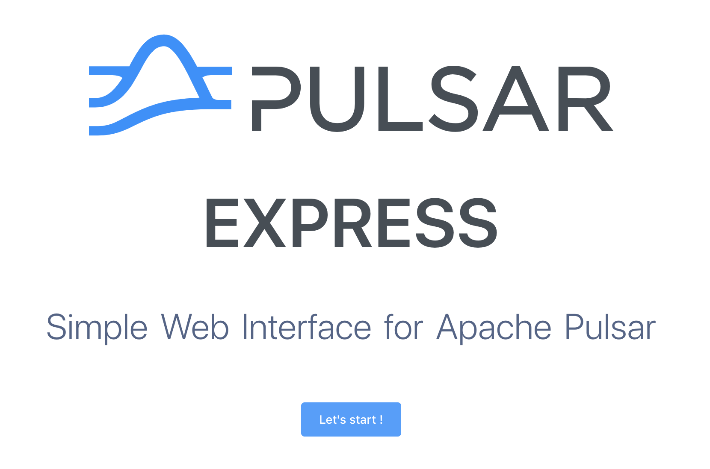
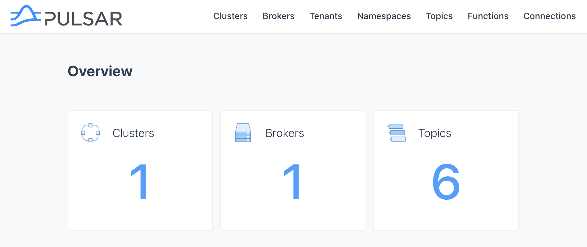
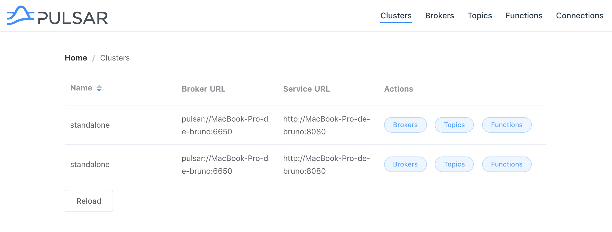
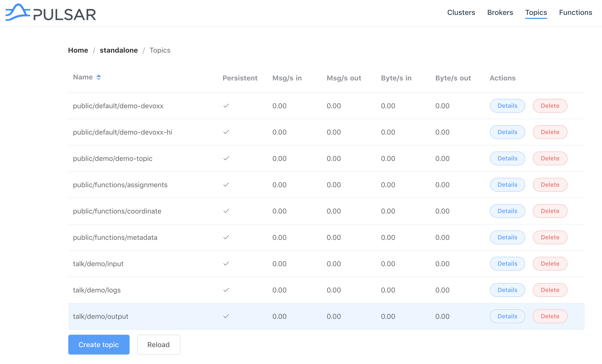
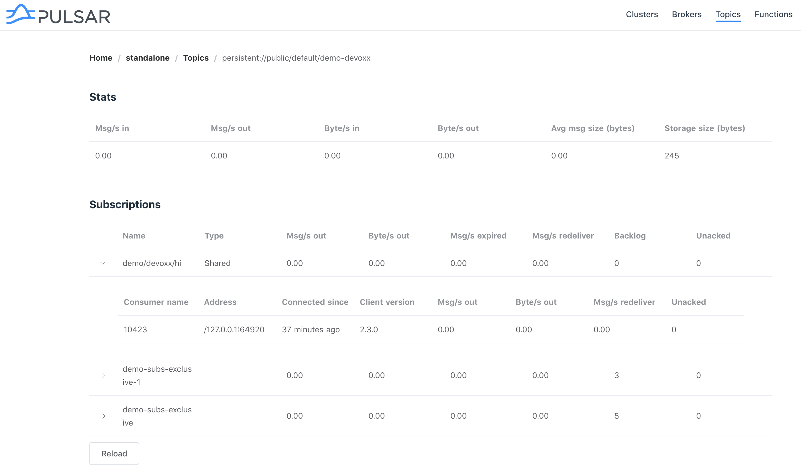
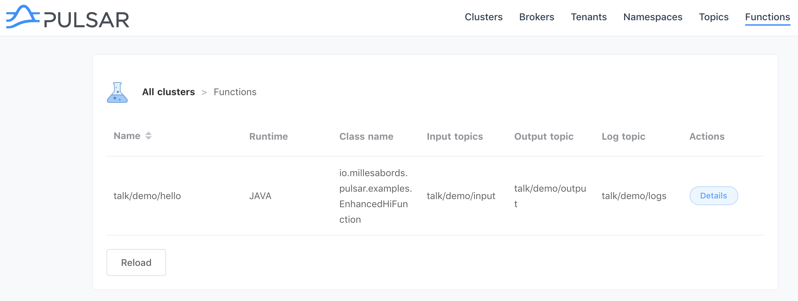
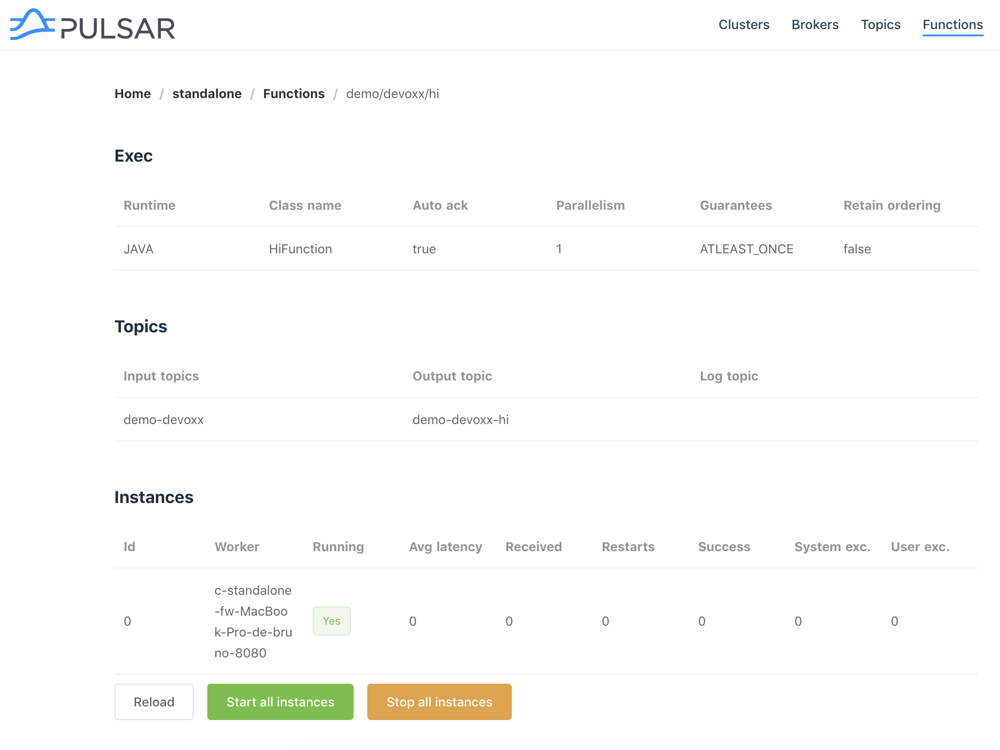

# pulsar-express

> Simple Web Interface for Apache Pulsar


## Install

There are several ways to use `pulsar-express`:
* By cloning the projet and running it locally (see `Development` section)
* By installing it using `npm`
```bash
# Install it globally
$ npm install pulsar-express -g

# Start it
$ pulsar-express

        ╭────────────────╮
        │ PULSAR EXPRESS │
        ╰────────────────╯

        => Open http://localhost:3000


# Start it on a specific port
$ PORT=8000 pulsar-express

        ╭────────────────╮
        │ PULSAR EXPRESS │
        ╰────────────────╯

        => Open http://localhost:8000

```

If you want to configure connections (to be available to all users), you can:
* Create a json file with the connections:
```json
[
  { "name": "test cluster", "url": "http://test-cluster-host:8080" },
  { "name": "integration cluster", "url": "http://int-cluster-host:8080" }
]
```
* and set the env variable `PE_CONFIG_FILE`
```bash
export PE_CONFIG_FILE=/path/to/my/config.json
```
* Or you can also set a connection URL
```bash
export PE_CONNECTION_URL=http://pulsar-host:8080

# Without a name, the url will be used (hostname:port),
# Or you can set a name
export PE_CONNECTION_NAME=my-pulsar
```

From there, you can connect with your browser to the url above !




### Overview

You can see some basic informations.




### Clusters



### Topics





### Functions






## How to

* First step, you have to define a connection (for sending requests to the API)
  * These connections are stored on client side (localstorage of your browser)
* Then, you can access the clusters, the topics and the functions

## Development

This app has been developed with [Nuxt.js](https://nuxtjs.org).

``` bash
# install dependencies
$ npm install

# serve with hot reload at localhost:3000
$ npm run dev

# build for production and launch server
$ npm run build
$ npm start
```

For detailed explanation on how things work, checkout [Nuxt.js docs](https://nuxtjs.org).


## To do

> A lot of things of course :), but the main step is to change the architecture and add a backend instead of making the queries from the browser. This backend could provide api, cache, better management of configuration, ...

* Navigation: add a way to change the cluster in each page
* More functions for each items (delete, update, ...)
* Auto refresh
* ...And many things !!!


## Known issues

* When creating a topic, the API response is always 405 Method Not Allowed :(
